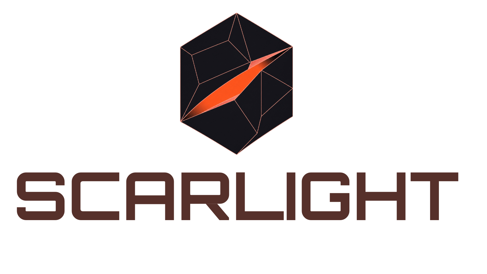

# Scarlight

<p align="center">
  
</p>

<p align="center">
  <a href="https://github.com/giannisp09/scarlight/actions/workflows/tests.yml"></a>
  <a href="https://github.com/giannisp09/scarlight/actions/workflows/lint.yml"></a>
  <a href="./LICENSE"></a>
  
  <a href="./CODE_OF_USE.md"></a>
</p>

> **A universal, self-improving agent harness for cyber superintelligence — offensive-security first.**

Scarlight is an open-source agent harness for offensive security work: authorized penetration testing, bug bounty hunting, CTF, red-team operations, and security research. It is opinionated, sandboxed, scope-aware, and designed to *compound* — the harness, the skill library, and the agent population get measurably better with use.

---

## Why Scarlight exists

The 2024–2026 offensive-security AI boom produced 70+ open-source agents — CAI, HackSynth, PentestGPT, HackingBuddyGPT, ctf-agent, RapidPen, AutoPentester, HexStrike — plus closed platforms like XBOW. But there is no canonical *harness*: an opinionated runtime that treats offensive security as a first-class domain, applies XBOW-style coordinator/worker scaling, Voyager-style skill libraries, Darwin-Gödel-Machine-style self-modification, and the security boundaries this work requires.

Most existing tools are model wrappers. They hallucinate findings, get tunnel-visioned, lose context, exfiltrate credentials into prompts, and never get better between sessions. They are inadequate for serious work and dangerous for autonomous deployment.

Scarlight is the harness that fixes this. It is to offensive security what Claude Code / OpenCode are to coding — except self-improving.

---

## The thesis

**Harness quality > model quality.** Anthropic, LangChain, and OpenAI engineering teams have published the same finding independently: at the frontier, harness improvements move benchmarks more than model upgrades do. Scarlight bets on this: a great harness with a B-grade frontier model beats a vanilla loop with a frontier model.

**Compounding skill library > one-shot prompting.** Voyager's skill library and Hermes Agent's autonomous skill creation prove that agents that *write down what worked* and *retrieve it next time* outpace stateless agents within hours.

**Deterministic validation > LLM trust.** XBOW reached #1 on HackerOne by separating "AI discovers" from "deterministic logic validates". Hallucinated findings are the #1 failure of offensive AI; the only durable defense is a verifier.

**Coordinator + ephemeral workers > monolithic agent.** Thousands of short-lived workers, each with fresh context and a narrow objective, beat one long-running agent that accumulates bias and context collapse.

**Self-improvement > static capability.** Darwin Gödel Machine showed +30 percentage points on SWE-bench by letting the agent rewrite its own harness. Applied to offensive security with a benchmark like Cybench as the reward signal, this is the path to superintelligent capability.

---

## What Scarlight is not

- **Not a script kiddie tool.** Default-deny network policy, signed Rules of Engagement, scope enforcement at the gateway. If you try to point it at a target you don't own and haven't authorized, it refuses.
- **Not a model.** Scarlight is model-agnostic. Frontier models (Claude, GPT, Gemini), open-weights (Llama, Qwen, DeepSeek), and local models are all first-class.
- **Not a framework.** Scarlight is a harness — opinionated control flow, runtime, and infrastructure. You write skills and policies, not glue.
- **Not closed source.** Apache 2.0 core, with an explicit Authorized Use Policy. See [`CODE_OF_USE.md`](./CODE_OF_USE.md).

---

## Quickstart

> ⚠️ **Authorized use only.** Scarlight is for systems you own or have written
> authorization to test. Read [`CODE_OF_USE.md`](./CODE_OF_USE.md) first.

Requires **Python 3.11+** and [**uv**](https://docs.astral.sh/uv/).

```bash
# Clone
git clone --recurse-submodules https://github.com/giannisp09/scarlight.git
cd scarlight

# Create a venv and install (all extras + dev tools)
uv venv venv --python 3.11
export VIRTUAL_ENV="$(pwd)/venv"
uv pip install -e ".[all,dev]"

# First run — health check, then a smoke chat
venv/bin/scarlight doctor
venv/bin/scarlight chat -q "Hello"
```

On **Windows**, run the PowerShell installer instead:
[`scripts/install.ps1`](./scripts/install.ps1) (it provisions Python via `uv`
and installs Scarlight natively — no WSL required).

Add at least one LLM provider key (any of `ANTHROPIC_API_KEY`,
`OPENAI_API_KEY`, `OPENROUTER_API_KEY`, …) to `~/.scarlight/.env`. Full
setup — global symlink, config, browser tools — is in
[`CONTRIBUTING.md`](./CONTRIBUTING.md#development-setup).

### See it drive an engagement

```bash
demo/run.sh
```

A ~3-minute recordable showcase: scope-guard refusal → signed
authorization → lab spin-up → Kali-sandboxed engagement → an
autonomously-written skill → teardown. Offensive work runs against an
opt-in [`engagement.yaml`](./engagement.yaml.example) scope — targets you
haven't authorized are refused.

---

## Benchmarks

Scarlight ships a **benchmark-agnostic evaluation harness**
([`environments/benchmarks/`](./environments/benchmarks/)) so capability is
measured, not asserted. It provides an adapter protocol, a per-run budget +
`max_usd` cost cap, a run recorder (`scarlight-bench-v1` schema),
contamination checks, reporting, and an [Inspect](https://inspect.aisi.org.uk/)
bridge.

| Benchmark | Status |
|-----------|--------|
| **ExploitGym** | Wired onto the harness (SkyPilot one-command cloud runner) |
| **Cybench** | Adapter scaffolded |
| **XBOW / HTB** | Adapters scaffolded (live wiring in progress) |

A **Tier-0 offline suite** (MockAdapter + StubModel, 70 tests, no LLM or
Docker) runs in ~3s and gates the harness in CI. See
[`specs/benchmarking-harness-v1/`](./specs/benchmarking-harness-v1/) for the
design and validation plan.

---

## Long-range vision: the 11 pillars (parked)

> The 11-pillar design and the ADRs below are an **earlier architecture exploration**, kept in [`docs/`](./docs/) as reference. They are **parked — not v1's committed scope.** v1 is the lean hermes-agent fork-and-adapt described in [`specs/`](./specs/); if `specs/` and `docs/` disagree, `specs/` wins. The sections below describe where Scarlight may go, not what v1 builds.

| # | Pillar | Job |
|---|--------|-----|
| 1 | **Hydra** — Cognitive Core | Multi-model orchestration, planner/summarizer, model racing, **local-first model tiering** |
| 2 | **Forge** — Control Plane | Stateless-reducer loop, coordinator + ephemeral workers, pause/resume, **code-mode subloop** |
| 3 | **Arsenal** — Execution Substrate | MicroVM sandboxes, pre-loaded toolchain (incl. coding tools), MCP-native tools |
| 4 | **Codex** — Skill Library | Voyager-style executable skills, autonomous skill creation, composable |
| 5 | **Mnemos** — Memory & Context | Episodic + semantic + target-graph memory, cross-session FTS |
| 6 | **Oracle** — Deterministic Validation | Verifiers, proof-of-exploit, non-destructive challenge generation |
| 7 | **Phoenix** — Self-Improvement Engine | **Tiered** harness self-modification (T0–T3), archive, anti-reward-hacking |
| 8 | **Crucible** — Evaluation Harness | Cybench/CAIBench/HackSynth-compatible, regression guards, **verifiers-as-environments** |
| 9 | **Aegis** — Safety, Authorization, Scope | Signed ROE, target allowlists, default-deny egress, capability tokens, **air-gapped mode** |
| 10 | **Lighthouse** — Observability & Forensics | OpenTelemetry tracing, signed audit log, replayable sessions, **trajectory export for Anvil** |
| 11 | **Anvil** — RL Training & Post-Training | Opt-in RLVR via `prime-rl` + `verifiers` + Crucible; SFT/DPO/GRPO/DAPO; federated training |

See [`docs/ARCHITECTURE.md`](./docs/ARCHITECTURE.md) for the original ten pillars in depth, [`docs/pillars/anvil.md`](./docs/pillars/anvil.md) for Pillar 11, and [`docs/decisions/`](./docs/decisions/) for the architecture decision records (ADRs 0004–0007) that refine the design.

## Key architectural decisions (parked exploration)

- **[ADR 0001](./docs/decisions/0001-license-apache-2.md)** — Apache 2.0 with separate Authorized Use Policy.
- **[ADR 0002](./docs/decisions/0002-language-split.md)** — Python control plane, Rust trust path, TypeScript UI, WASM skill sandbox.
- **[ADR 0003](./docs/decisions/0003-mcp-native.md)** — MCP-native tools; open protocols.
- **[ADR 0004](./docs/decisions/0004-coding-mode.md)** — Code-fluent, not a coding harness; code-mode subloop, two-way MCP interop with Claude Code / OpenCode.
- **[ADR 0005](./docs/decisions/0005-self-modification-tiers.md)** — Self-modification is tiered (T0–T4); Phoenix can mutate skills/strategy/harness code but **cannot mutate Aegis or Lighthouse**.
- **[ADR 0006](./docs/decisions/0006-local-first.md)** — Local-first; `air_gapped` / `local_default` / `hybrid` / `cloud` deployment modes; vLLM / SGLang / Ollama / MLX; recommended local models per 2026 benchmarks.
- **[ADR 0007](./docs/decisions/0007-rl-training-opt-in.md)** — Anvil: opt-in RL training; `prime-rl` + `verifiers` foundation; federated gradient contribution.
- **[ADR 0008](./docs/decisions/0008-forge-topology.md)** — Forge topology: adaptive bounded hierarchy with dynamic fan-out; max depth 3; five topology profiles (linear / parallel-flat / hierarchical / hybrid / swarm-lateral); shared Mnemos target graph + engagement bus as the lateral substrate.

---

## Repository layout

v1 is a fork-and-adapt of [`nousresearch/hermes-agent`](https://github.com/nousresearch/hermes-agent): the codebase is hermes-agent's module layout, rebranded `hermes` → `scarlight` (`agent/`, `providers/`, `plugins/`, `environments/`, `skills/`, `tools/`, `scarlight_cli/`, `gateway/`, `docker/`, …). Layered on top is Scarlight's own product layer:

```
scarlight/
├── README.md                 — this file
├── LICENSE                   — Apache 2.0
├── NOTICE                    — hermes-agent MIT attribution (Scarlight is a derivative work)
├── CODE_OF_USE.md            — Authorized Use Policy (non-negotiable for contributors)
├── AGENTS.md                 — standing context for any agent acting on this repo
├── specs/                    — SDD product layer — the committed v1 plan (source of truth)
│   ├── mission.md            — what Scarlight is, who it's for, what v1 is/isn't
│   ├── tech-stack.md         — the hermes-agent fork: keep / change / remove / add
│   ├── roadmap.md            — Phase 0 (fork) → Phase 1 (adapt) → deferred revisit
│   ├── fork-runbook.md       — concrete step-ordered fork procedure
│   └── README.md             — specs/ index
├── docs/                     — parked architecture exploration (reference only, not v1 scope)
│   ├── ARCHITECTURE.md       — 11-pillar design (parked)
│   ├── PRIOR_ART.md          — research survey
│   ├── THREAT_MODEL.md       — threat-model exploration
│   ├── PILLARS.md            — pillar one-pager (parked)
│   ├── pillars/              — one doc per pillar (parked)
│   └── decisions/            — ADRs (architecture decision records)
└── examples/                 — reference engagement configs (CTF, lab, bug-bounty)
```

See [`specs/roadmap.md`](./specs/roadmap.md) for the plan and [`specs/fork-runbook.md`](./specs/fork-runbook.md) for the procedure.

---

## Status

**Phases 0 + 1 complete; Phase 2 (v1.1 active exploitation) skills landed.** fork-runbook Steps 1–9 are done: the hermes-agent fork landed, was rebranded (`hermes` → `scarlight`, relicensed Apache-2.0), trimmed to the offensive surface, re-aimed at offensive-security work with seeded `recon` and `web-basic` skills, pinned to a Kali sandbox (`kalilinux/kali-last-release`), gated behind an `engagement.yaml` authorization-scope guard, and driven end-to-end against an OWASP Juice Shop lab — recon → six findings → an autonomously-refined `juice-shop-fingerprint` skill. **Phase 2 (v1.1 active exploitation)** then landed eight kill-chain skills (`web-exploit`, `password-attack`, `service-exploit`, `payload-craft`, `privesc-linux`, `privesc-windows`, `credential-harvest`, `lateral-movement`), the offensive `CONVENTIONS.md`, per-target authorization enforcement, and a host-persisted `~/.scarlight/audit/exploitation.jsonl` audit trail. v1.1 passes its static acceptance gates (scope-guard, documentation, regression — see [`specs/exploitation-v1/validation.md`](./specs/exploitation-v1/validation.md)); the live kill-chain suite is the remaining gate for full active-exploitation sign-off.

**`v1.0.0`** is tagged (first public release). **`v1.1.0`** adds the benchmarking harness (see [Benchmarks](#benchmarks)) and this release's public-readiness pass. See [`CHANGELOG.md`](./CHANGELOG.md) for the full history.

A recordable showcase lives at [`demo/`](./demo/) — `demo/run.sh` drives the full engagement in ~3 minutes with seven banner-framed acts (scope-guard refusal → authorization → lab spin-up → Kali sandbox engagement → autonomous skill write → teardown).

[`specs/`](./specs/) is the committed source of truth; [`specs/fork-runbook.md`](./specs/fork-runbook.md) tracks the step-ordered procedure. The 11-pillar design in [`docs/`](./docs/) is earlier exploration — parked, not committed scope.
